<div align="center">

<!-- Animated Pixel Art Cassette Tape -->


# 🎵 Melodia

### _Immersive Synced Lyrics Player_

**Dengarkan lagu lengkap + lirik sinkron real-time.**<br>
**Cari lagu apapun. Lirik otomatis muncul & mengikuti musik secara presisi.**

[](https://react.dev)
[](https://vite.dev)
[](LICENSE)

</div>

---

## 🎨 Apa itu Melodia?
**Melodia** adalah pemutar musik web premium berbasis web yang menyinkronkan lirik lagu secara real-time. Dengan menghubungkan basis data lirik **LRCLIB** dan audio streaming dari **Piped (YouTube API)**, Melodia menghadirkan lirik karaoke yang presisi dibalut dengan desain estetika modern bernuansa retro-future.

---

## ✨ Fitur Utama

```
🎧  Full-length streaming      Putar lagu penuh lewat YouTube (hidden player)
🔍  Smart search                Cari lagu, artis, atau album — hasil instan
🏠  Home Dashboard              Halaman muka interaktif dengan saran lagu populer
📝  Synced lyrics               Lirik real-time yang mengikuti beat musik
⛶  Fullscreen Lyrics           Fokus mendengarkan musik dengan lirik layar penuh (immersive)
💬  Artist Recommendations      Panel rekomendasi lagu lain dari penyanyi yang sama secara real-time
🔁  Smart Auto-Play             Lagu berikutnya otomatis diputar ketika lagu aktif selesai
⏮/⏭ Track Navigation          Navigasi mudah ke lagu sebelum/sesudah dalam riwayat putar
🎨  4 premium themes            Pastel Dream · Retro VHS · Dark Space · Cyberpunk
📊  Live visualizer             Animasi audio bars 60fps di canvas
🔧  Sync offset                 Geser timing lirik ± 0.1 detik jika tidak pas
```

---

## 🚀 Cara Menjalankan

### Menggunakan Script Pembantu (Rekomendasi)
Jika Anda menggunakan Windows dan tidak memiliki Node.js global, Anda bisa langsung menjalankan perintah ini di folder proyek:

```powershell
# Jalankan server development
.\run-dev.ps1
```

### Secara Manual (Jika Node.js terinstal secara global)
```bash
# Install dependencies
npm install

# Run dev server
npm run dev
```

Buka **http://localhost:5173** di browser Anda.

---

## 🎨 Tema Premium

<table>
<tr>
<td align="center">🌸<br><b>Pastel Dream</b><br><sub>Warna pink lembut & estetika hangat</sub></td>
<td align="center">📼<br><b>Retro VHS</b><br><sub>Warna cyan neon & scanlines CRT</sub></td>
<td align="center">🌌<br><b>Dark Space</b><br><sub>Estetika ungu nebula luar angkasa</sub></td>
<td align="center">⚡<br><b>Cyberpunk</b><br><sub>Kontras tinggi kuning & merah neon</sub></td>
</tr>
</table>

---

## 🛠️ Tech Stack & API

| Layer | Teknologi / API | Fungsi | Gratis? |
|-------|-----------------|--------|:-------:|
| ⚛️ Framework | **React 19 + JSX** | Struktur UI Modular | ✅ |
| ⚡ Build Tool | **Vite 8** | Bundler & Development Server super cepat | ✅ |
| 🎵 Audio | **YouTube IFrame API** | Audio streaming (disembunyikan secara visual) | ✅ |
| 🔍 Search / Stream | **Piped API** | Pencarian video & backup stream otomatis | ✅ |
| 📝 Lirik | **LRCLIB.net** | Pengambilan lirik sinkron format LRC | ✅ |
| 🖼️ Album Art | **Deezer API** | Pengambilan cover album melalui JSONP | ✅ |

---

## 📁 Struktur Project Baru (Modular)

```
music/
├── index.html                  # Entry point HTML
├── package.json                # Dependensi & script proyek
├── public/
│   └── pixel-art.svg           # Animasi pixel art cassette tape
└── src/
    ├── main.jsx                # React mount point
    ├── App.jsx                 # 🎯 Main Shell & global state orchestrator
    ├── constants.js            # ⚙️ Konstanta & Quick Suggestions
    ├── components/             # 🧱 Komponen UI Terpisah
    │   ├── TopBar.jsx          # Header search & theme switcher
    │   ├── HomePage.jsx        # Landing page dashboard
    │   ├── NowPlaying.jsx      # Info lagu & cover art aktif
    │   ├── Visualizer.jsx      # Canvas audio visualizer 60fps
    │   ├── LyricsPanel.jsx     # Panel lirik reguler
    │   ├── FullscreenLyrics.jsx# Overlay lirik layar penuh
    │   ├── RecommendedPanel.jsx# Panel rekomendasi lagu artis sejenis
    │   └── PlayerBar.jsx       # Kontrol audio (Play, Prev, Next, Seek)
    ├── hooks/
    │   └── useYouTubePlayer.js # 🎣 Custom hook manajemen YouTube IFrame API
    └── utils/
        ├── api.js              # 🌐 Integrasi API (Piped, LRCLIB, Deezer)
        └── helpers.js          # 🛠️ Helper waktu, parser LRC, & sorting video
```

---

## 📄 Lisensi
Proyek ini dilisensikan di bawah lisensi MIT.

<div align="center">

**Made with ❤️ and lots of 🎵**

<sub>Built with React + Vite · Powered by open APIs</sub>

</div>
